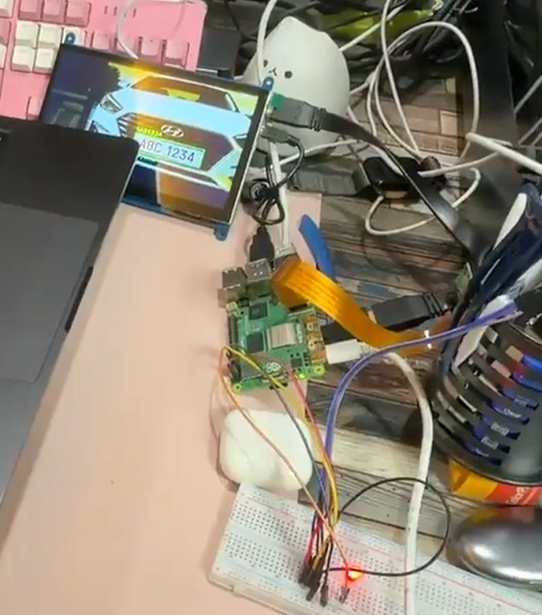

# Raspberry Pi 5 YOLO License Plate Detection Event

## 1. Project Overview

This project is a modified version of the car plate recognition system from Random Nerd Tutorials.

The original project flow was:

```text
PIR sensor detects motion
→ Raspberry Pi Camera takes a photo
→ OpenALPR API identifies the license plate and car model
→ GPIO17 turns ON for a few seconds
→ GPIO17 turns OFF
```

However, the OpenALPR API requires a paid API service.  
Therefore, this project replaces the paid API with a local YOLO-based license plate detection system running directly on the Raspberry Pi 5.

The final implemented flow is:

```text
PIR sensor detects motion
→ Raspberry Pi Camera captures the vehicle image shown on a computer monitor
→ YOLO ONNX model detects the license plate area
→ Tesseract OCR reads English letters and numbers from the plate
→ The result image shows the detected plate box and recognized text in green
→ The result image is displayed on a 7-inch HDMI LCD for 5 seconds
→ GPIO17 turns ON for 5 seconds
→ The image window closes
→ GPIO17 turns OFF
```

### 1-1. Screenshot & Video


[Youtube Link](https://youtu.be/_YoLWsF5iic)

## 2. Hardware Used

```text
Raspberry Pi 5
Raspberry Pi Camera Module
PIR motion sensor
7-inch HDMI LCD display
GPIO17 output device, such as LED or relay
Computer monitor displaying a vehicle front image with a clear license plate
```

## 3. GPIO Wiring

### PIR Sensor

```text
PIR VCC  → Raspberry Pi 5V
PIR GND  → Raspberry Pi GND
PIR OUT  → GPIO4 / Physical Pin 7
```

### GPIO17 Output

```text
GPIO17 / Physical Pin 11 → LED or relay input
GND                      → LED or relay GND
```

In the Python code:

```python
pir = MotionSensor(4)
gpio17 = OutputDevice(17, active_high=True, initial_value=False)
```

If the relay works in reverse, change this line:

```python
gpio17 = OutputDevice(17, active_high=True, initial_value=False)
```

to:

```python
gpio17 = OutputDevice(17, active_high=False, initial_value=False)
```

## 4. Development Process

### Step 1. Camera Recognition

The Raspberry Pi Camera was first checked with:

```bash
rpicam-hello --list-cameras
```

The camera was successfully detected as:

```text
0 : ov5647 [2592x1944 10-bit GBRG]
```

This confirmed that the camera was correctly connected to the Raspberry Pi 5.

### Step 2. Storage Problem

Initially, the Ultralytics Docker image was considered.  
However, the Raspberry Pi SD card had limited storage.

The disk status was:

```text
/dev/mmcblk0p2   14G   12G   2.1G   85% /
```

The Docker pull failed because the Ultralytics image required several gigabytes of storage.

The error was:

```text
no space left on device
```

Therefore, Docker and large PyTorch-based installation were abandoned.

### Step 3. Storage Cleanup

Unnecessary Docker files, pip cache, and previous assignment files were removed.

After cleanup, the disk status improved to:

```text
/dev/mmcblk0p2   14G   7.6G   5.7G   58% /
```

### Step 4. OpenCV DNN + YOLO ONNX

Instead of Docker or `pip install ultralytics`, this project uses:

```text
OpenCV DNN
YOLOv5 license plate ONNX model
Tesseract OCR
```

This approach is lighter and works better on a Raspberry Pi with limited storage.

### Step 5. License Plate Model

The license plate detection model is downloaded as:

```bash
wget -O models/license_plate_yolov5s.onnx \
https://github.com/yakhyo/yolov5-license-plate-detection/releases/download/v0.0.1/anpr_yolov5s.onnx
```

The previously attempted filename `yolov5s.onnx` caused a 404 error.  
The correct file name is:

```text
anpr_yolov5s.onnx
```

### Step 6. OCR Improvement

The OCR result was initially inaccurate.  
For example, the plate could be incorrectly read as:

```text
N12547
```

To improve OCR speed and accuracy, the final code uses:

```text
YOLO model loaded only once
Camera initialized only once
Only the largest detected plate is used
Only two fast OCR preprocessing methods are used
English letters and numbers only
Format correction for plates like ABC1234
```

The expected plate format is:

```text
ABC1234
```

That means:

```text
First 3 characters: English letters
Last 4 characters: digits
```

Common OCR mistakes are corrected in the code.

For example:

```text
O → 0 in digit area
I/L → 1 in digit area
8 → B in letter area
5 → S in letter area
```

## 5. Required Packages

Install the required packages:

```bash
sudo apt update
sudo apt install -y \
  python3-opencv \
  python3-picamera2 \
  python3-numpy \
  python3-gpiozero \
  python3-lgpio \
  tesseract-ocr \
  tesseract-ocr-eng \
  feh \
  wget
```

## 6. Project Directory Setup

```bash
mkdir -p ~/plate-detection-event/models
mkdir -p ~/plate-detection-event/captures
mkdir -p ~/plate-detection-event/outputs
mkdir -p ~/plate-detection-event/outputs/crops
```

## 7. Download the YOLO License Plate Model

```bash
cd ~/plate-detection-event/models

wget -O license_plate_yolov5s.onnx \
https://github.com/yakhyo/yolov5-license-plate-detection/releases/download/v0.0.1/anpr_yolov5s.onnx
```

Check the file:

```bash
ls -lh license_plate_yolov5s.onnx
```

## 8. Run the Program

Copy `fast_plate_event.py` into:

```text
/home/pi/plate-detection-event/
```

Then run:

```bash
cd ~/plate-detection-event
python3 fast_plate_event.py
```

Expected startup log:

```text
System starting
Loading YOLO model once
Starting Pi Camera once
System ready
Waiting for PIR motion
```

When motion is detected:

```text
PIR motion detected
Captured image saved
YOLO plate detected
OCR result
Recognized plate text
GPIO17 ON
Showing result image on HDMI display
Closing image window
GPIO17 OFF
```

## 9. Output Files

Captured images are saved in:

```text
captures/
```

Final result images are saved in:

```text
outputs/
```

Cropped license plate images and OCR preprocessing images are saved in:

```text
outputs/crops/
```

The log file is saved as:

```text
outputs/event_log.txt
```

## 10. Result Image

The final result image displays:

```text
Green bounding box around the detected license plate
Recognized plate text in green above the license plate
Detection source and processing time
```

If YOLO fails to detect a plate, the program uses a fallback ROI around the lower center of the image.  
In that case, the box color is red and the source is shown as:

```text
FALLBACK_ROI
```

## 11. Notes on Accuracy

The OCR accuracy depends heavily on the quality of the image shown on the computer monitor and the camera capture condition.

Recommended conditions:

```text
Use a clear HD front image of a vehicle
Make the license plate large on the computer monitor
Place the plate near the center of the camera view
Increase monitor brightness
Reduce reflections
Keep the camera facing the monitor directly
```

The system works best when the plate is shown clearly, such as:

```text
ABC 1234
```

## 12. Why This Method Was Used

This project does not use OpenALPR API because it requires a paid API service.

It also avoids Docker and full Ultralytics installation because the Raspberry Pi SD card had limited storage.

Instead, it uses:

```text
YOLO ONNX model
OpenCV DNN
Tesseract OCR
GPIOZero
Picamera2
feh image viewer
```

This satisfies the assignment requirement because license plate recognition is performed locally on the Raspberry Pi without using a paid API.
